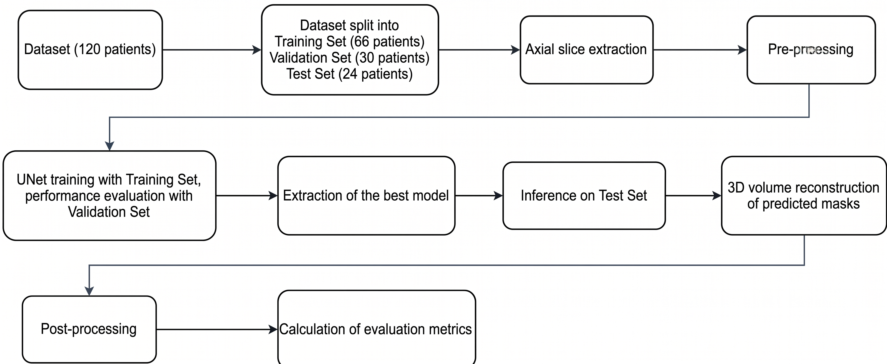
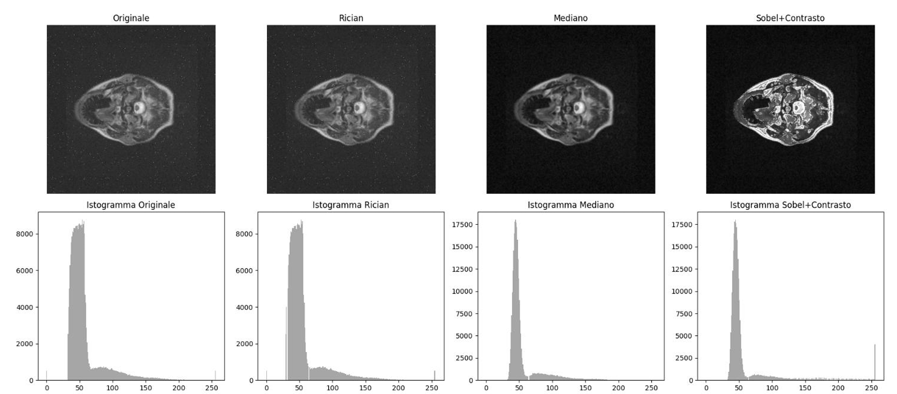
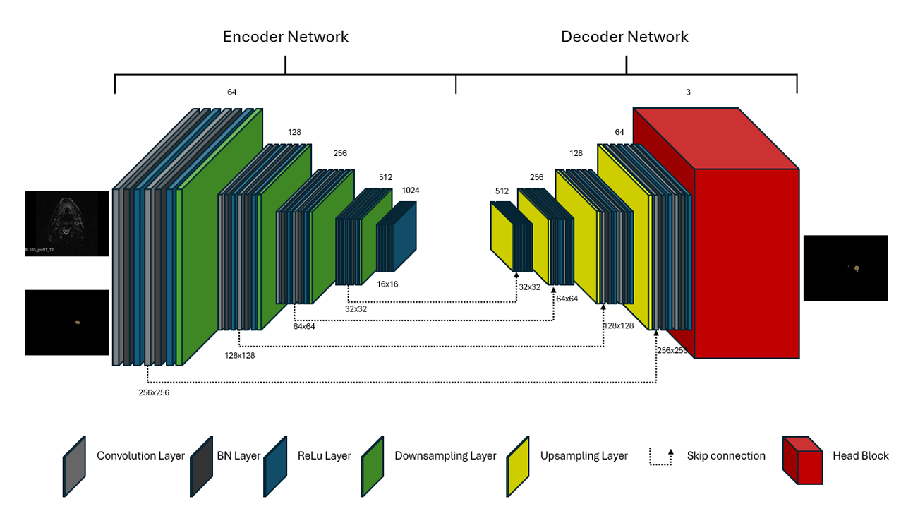
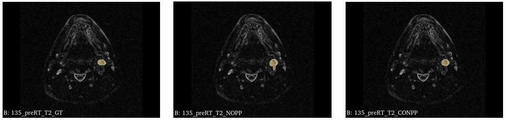

# Head & Neck Tumor Segmentation (Deep Learning MRI)


## 📌 Clinical Overview
Automated segmentation of primary tumor volumes ($GTV_p$) and metastatic lymph nodes ($GTV_n$) in Head and Neck Cancer (HNC) is a critical bottleneck in radiotherapy (RT) planning. Due to poor soft-tissue contrast and complex anatomy, manual contouring is heavily subject to inter-observer variability. 

This repository provides an end-to-end automated Deep Learning pipeline to segment $GTV_p$ and $GTV_n$ on T2-weighted MRI scans (pre-RT and mid-RT), acting as a proof-of-concept for MRI-guided radiotherapy workflows.

## 🏗️ Architecture & Pipeline

The project is structured as a complete medical imaging pipeline, handling everything from raw NIfTI volumes to 3D morphological post-processing.

 
*> Full repo pipeline.*

### 1. Data Stratification & Extraction
* **Dataset:** 120 unique patients (pre-RT and mid-RT scans).
* **Stratification:** Balanced split (Train 68%, Val 32%, Test 20%) maintaining clinical variance based on tumor presence and volumetric size.
* **Slicing:** Extraction of 2D axial slices with a $\pm 5$ slice contextual buffer to ensure spatial coherence.

### 2. Image Pre-processing (Enhancement Engine)
MRI T2 scans suffer from Rician noise and ambiguous tissue boundaries. The following pipeline is applied to every slice:
1. **Min-Max Normalization** to [0, 255] uint8 format.
2. **Custom Rician Denoising:** Utilizing Non-Local Means (NLM) coupled with Otsu's thresholding on a morphological gradient to clean homogeneous areas while preserving high-frequency edges.
3. **Median Filtering** ($3\times3$) to suppress salt-and-pepper artifacts.
4. **Edge Enhancement:** Sobel operators isolate biological contours, amplifying local contrast by a factor of 2.0 without boosting background noise.


*> Pre-processing steps applied sequentially to each slice.*

### 3. Deep Learning Model
* **Architecture:** 2D U-Net implemented via `MMSegmentation`.
* **Transfer Learning:** Initialized with Cityscapes pre-trained weights to accelerate convergence on a limited medical dataset.
* **Optimization:** Batch Normalization (BN) utilized across the backbone and decode heads for stability.


*> U-Net architecture used in this repo.*

### 4. Tackling Severe Class Imbalance (Composite Loss)
The dataset presents a critical imbalance: **98% background**, 1% $GTV_p$, and 1% $GTV_n$. Relying on standard Cross-Entropy leads to a collapsed model. I engineered a composite loss function:
* **Weighted CrossEntropyLoss (0.3):** Ensures stable gradient propagation.
* **Lovász-Softmax Loss (0.3):** Provides a differentiable surrogate to directly optimize the Intersection over Union (IoU) metric.
* **Tversky Loss (0.4):** Configured with $\alpha=0.7$ and $\beta=0.3$ to strictly penalize False Negatives (prioritizing clinical sensitivity over specificity).

### 5. 3D Morphological Post-Processing
2D predictions often lack spatial continuity. 2D masks are stacked back into NIfTI volumes and refined using 3D mathematical morphology:
* **Spurious Artifact Removal:** Filtering out isolated connected components (< 50 voxels for $GTV_p$, < 1200 voxels for $GTV_n$).
* **3D Morphological Closing:** Utilizing spherical structuring elements (radius 1 for $GTV_p$, radius 3 for $GTV_n$) to fill internal voids and regularize anatomical surfaces.


*> Ground Truth vs Raw Prediction vs Post-processed Prediction.*

---

## 📊 Performance Baseline (Test Set)

While the complex and varied nature of HNC limits absolute accuracy on a basic 2D U-Net, the integration of targeted pre-processing and 3D post-processing yielded measurable improvements across the test cohort (24 patients).

| Metric | $GTV_p$ (Primary) | $GTV_n$ (Nodes) |
| :--- | :--- | :--- |
| **DSC (Pre-processing only)** | 0.262 ± 0.252 | 0.295 ± 0.237 |
| **DSC (+ 3D Post-processing)** | **0.269 ± 0.257** | **0.319 ± 0.275** |
| **$\Delta V\%$ Error (Auto vs Manual)** | 61.5% ± 79.4% | 38.6% ± 48.5% |

*Note: Results highlight the inherent difficulty of mid-RT morphological variations and the limitations of 2D architectures in capturing 3D spatial coherence, establishing a clear baseline for future 3D volumetric models (e.g., V-Net, 3D U-Net).*

---

## 🚀 Usage & Reproducibility

### ⚡ Quickstart Demo (Inference on Sample Data)
To verify the inference pipeline without downloading the full dataset or training from scratch, you can run the model on a single provided sample.

1. **Download the required files:**
   - Download the trained weights (`best_model.pth`) from [https://www.kaggle.com/datasets/cristianassumma/best-model-for-u-net-mri-head-neck-tumor-segment] and place them in the `models/` directory.
   - Download the anonymized sample T2 MRI (`135_preRT_T2.nii.gz`) from [https://www.kaggle.com/datasets/cristianassumma/test-patient-for-u-net-mri-head-neck-tumor-segmen] and place it in `data/Dataset_gz/135/`.

2. **Run the inference:**
   Execute the following command. The script will load the T2 volume, run the 2D U-Net slice-by-slice, apply the 3D morphological post-processing, and save the result.
   
   ```bash
   python src/inference/predict.py \
     --dataset-dir data/Dataset_gz \
     --excel-path data/sample_test.xlsx \
     --output-dir data/Inference_Results \
     --config src/training/unet_config.py \
     --checkpoint models/best_model.pth
    ```
   *> (Note: The script attempts to process both `preRT` and `midRT` timepoints. A `FileNotFoundError` for the `midRT` file is expected for this quickstart sample, as only the `preRT` scan is provided here).*

3. **Check the Output:**
   The segmented 3D volume will be saved in `data/Inference_Results/135/SEG_135_preRT_T2_post.nii.gz`.


### 1. Environment Setup
Clone the repository and install the strict dependencies (requires CUDA 12.1).
```bash
git clone [https://github.com/yourusername/head-neck-tumor-segmentation.git](https://github.com/yourusername/head-neck-tumor-segmentation.git)
cd head-neck-tumor-segmentation
pip install -r requirements.txt
```
### 2. Data Preparation
Place yout raw .nii.gz files in data/Dataset_gz/.
Run the clinical stratification and preprocessing engine:
```bash
python src/preprocessing/data_splitter.py
python src/preprocessing/slice_extractor.py
python src/preprocessing/image_enhancement.py
```
### 3. Training the U-Net
Execute the MMSegmentation pipeline:
```bash
python src/training/train.py --base-config src/training/unet_config.py
```
### 4. Inference & 3D Post-processing
Generate predictions and apply 3D morphological closing:
```bash
python src/inference/predict.py --config src/training/unet_config.py --checkpoint models/best_model.pth
```
### 5. Clinical Evaluation
Calculate Dice Similarity Coefficients and Volumetric Variations:
```bash
python src/evaluation/evaluate.py --use-postprocessed
```

---

## 📬 Contact

**Ing. Cristian Assumma**  
*MSc Biomedical Engineer | AI Healthcare & MedTech*

* [LinkedIn](https://www.linkedin.com/in/cristian-assumma-08890b224)
* [GitHub](https://github.com/cristian-assumma)

---

